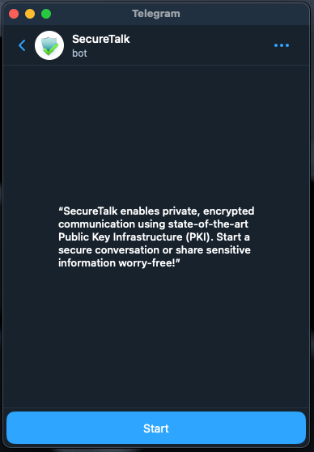
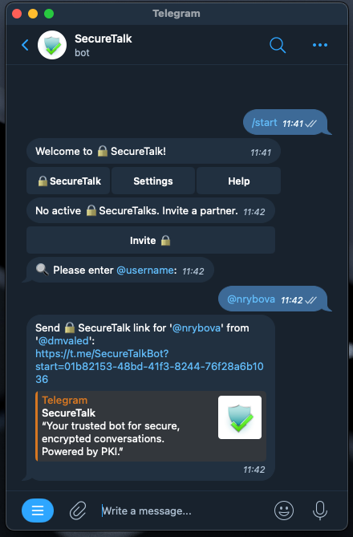
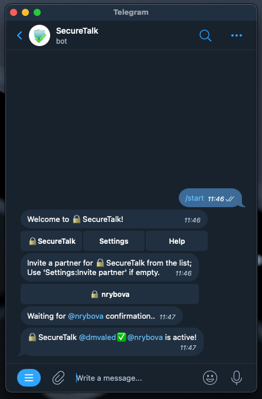
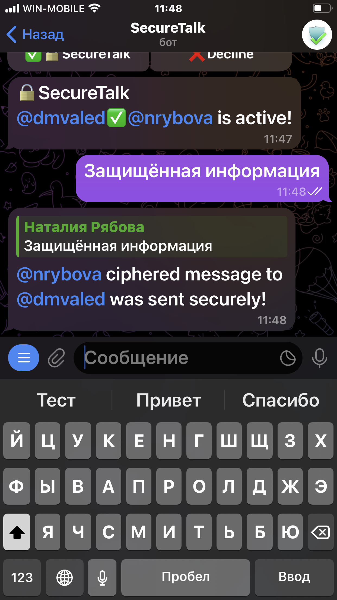
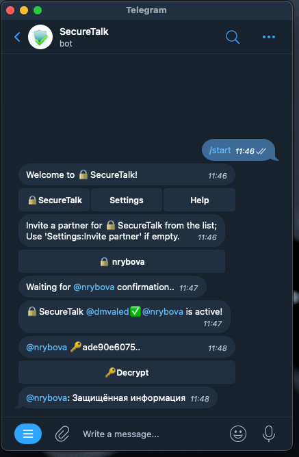
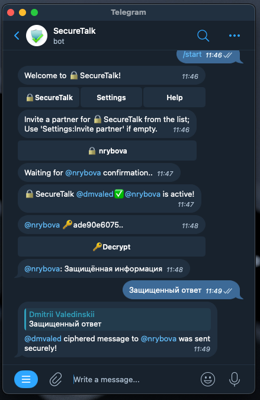
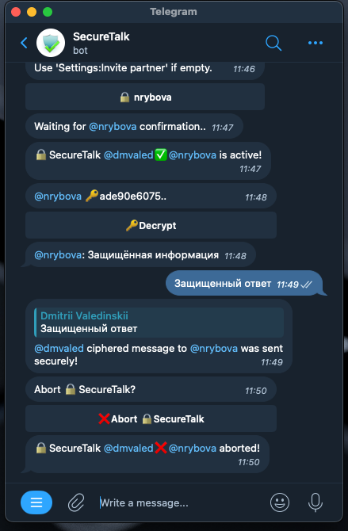
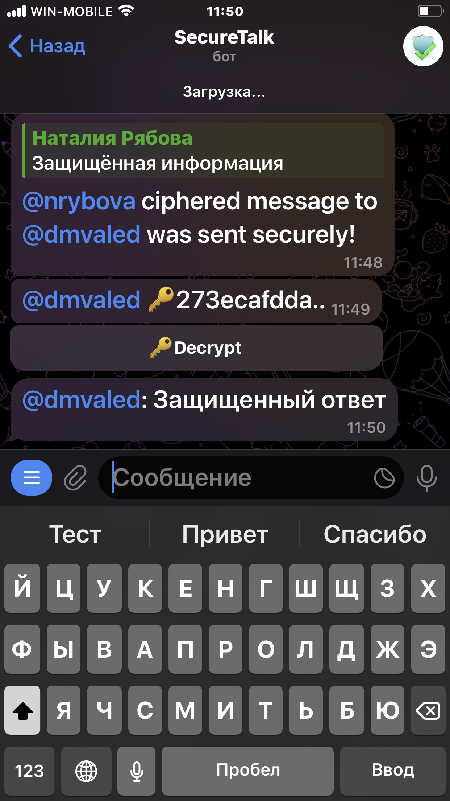
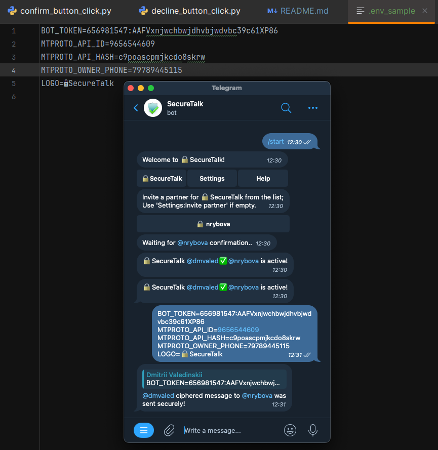

### @ShieldBot: Your Companion for Secure Telegram Conversations

ShieldBot ensures private, end-to-end encrypted messaging on Telegram,
empowering users to protect their conversations with an added layer of security.

✨ Key Features:

    End-to-End Encryption: Messages are encrypted locally and decrypted only by the intended recipient.
    Steganography Integration: Send secure messages disguised as images or media.
    Open-Source Transparency: Fully auditable code to build user trust.
    Customizable Encryption Options: Choose between traditional ciphers or advanced steganography.
    User-Friendly Design: Easy setup with PKI for seamless encryption.

🔧 Built With:

    Python with aiogram for Telegram Bot API integration.
    Dockerized Deployment for portability and scalability.
    Public Key Infrastructure (PKI) for secure key exchanges.
    Optional steganography for multimedia-based encryption.

🌟 Why @ShieldBot?

Privacy and security in online communication are more important than ever.
@ShieldBot is designed to provide the highest level of security for users who value confidentiality,
whether in personal or professional messaging.

🚀 Try It Out!

    Set up ShieldBot locally or deploy it using Docker.
    Contribute your ideas and improvements via pull requests.

Пример использования:

